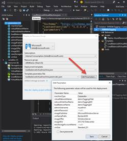

# ARM Templates
This guide provides steps to setup and demonstrate ARM templates.

## Contents
* [Pre-Requisites](#pre)
* [Setup](#setup)
* [Demo Steps](#demo)
* [Clean Up](#clean)

##  Pre-Requisites
1. An Azure subscription
2. Visual Studio 2015

##  Setup 
*Estimated Setup Time: 10 minutes*

1.	Open the “VMWithTagging” solution in Visual Studio 2015.  
2.	Right-click the “Deploy-AzureResourceGroup.ps1” file and choose “Open in PowerShell ISE”.  
3.	Run the script in PowerShell.  It will prompt you for a location, password, and storage account name.  Make sure the storage account name is globally unique, you may wish to append your name to it to ensure uniqueness.
4.	Once the script is done, the resources will be deployed to your subscription.

    

    

##  Demo Steps
*Estimated Time: 10 minutes*

1.	Log into the Azure Portal (https://portal.azure.com) 

2.	Choose New . Management / Resource Group.  Provide a name and location.	 

    

3.	Choose Add / Template Deployment.  This is a way for you to deploy your own templates by copying and pasting into the Edit Template area.	 

    

4.	Go to https://github.com/Azure/azure-quickstart-templates and show the starter templates.  

5.	Open the 201-web-app-hithub-deploy and follow the link to the documentation page.

6.	Explain the documentation, it shows parameters that the template requires.

7.	Click on the “Deploy to Azure” button and show that the parameters appear in the portal.  This is really the same thing as when we created a Template Deployment previously.

	 

    

8.	Click the “Edit template” option.  Show that it is the same JSON that was referenced in the documentation article.  	 

    

9.	Open Visual Studio 2015 and open the VMWithTagging solution.  Visual Studio 2015 provides tooling specific to ARM templates that makes authoring easier, including a JSON Outline and tooling to add new resources.  Show the .json files.  The first file is the template, the second file is a parameters file to use during development.

10.	Point out that this is a fairly complex yet common deployment, by creating a template you increase reusability and decrease support issues, which is crucial in a Managed Services environment.	 

    

11.	Right-click the VMWithTagging project node in Visual Studio and choose Deploy.  When prompted, click the Edit Parameters button.  Visual Studio provides an easy interface to edit the template parameters file and to deploy to your subscription.

12.	Click Cancel to back out of the dialog.	 

    

13.	Right-click the Deploy-AzureResourceGroup.ps1 file and choose Open with PowerShell ISE.	 

    

14.	Point out the PowerShell cmdlet to deploy the template.  

15.	During setup, you should have already deployed the template.  Point out that ARM templates are idempotent and you can safely run the template again.  	 

    

    

16.	The tooling in Visual Studio makes authoring much simpler.  Right-click the resources node in the JSON Outline and choose Add New Resource.  Show the various resources that you can provision.  Add a storage account.  

17.	Show the generated JSON.  Point out the type property that is Microsoft.Storage/storageAccounts.  This is a provider.

18.	CLOSE THE FILE and DO NOT SAVE.	 

    

    

19.	Go back to PowerShell ISE.  Use the cmdlet Switch-AzureMode AzureResourceManager.  

20.	Run the cmdlet Get-AzureLocation to show the various providers and the locations they are available in.  There are services that cannot be provisioned with ARM templates today, however this is the future of the Azure platform and you can expect to see continued investment here.	 
    

    

21.	Use the cmdlet Get-AzureResourceGroup to show the resource groups available.  Point out that all resources have a resourceId to uniquely address the resource.

22.	Use the cmdlet Get-AzureResource –ResourceId and provide the resource ID from the previous execution.  Addressing a resource by its ID allows you to manage resources such as moving them to another resource group.	 
    
    
    

    

##  Clean Up
To clean up after this demo perform the following steps:

1.	Close PowerShell ISE without saving.  
