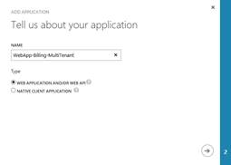
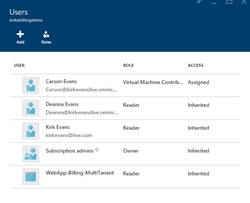
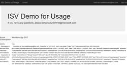

# Tagging, RBAC, and Usage
This guide provides steps to setup and demonstrate using tagging data with the usage API and restricting access to resources using RBAC.

## Contents
* [Pre-Requisites](#pre)
* [Setup](#setup)
* [Demo Steps](#demo)
* [Clean Up](#clean)

##  Pre-Requisites
1. An MSDN Azure subscription
2. Visual Studio 2015 or later

##  Setup 
*Estimated Setup Time: 10 minutes*

1. Open the VMWithTagging solution in Visual Studio 2015.  Show the template editing and JSON Outline for developing new templates.
2. Right-click on the Deploy-AzureREsourceGroup.ps1 file and choose “Open with PowerShell ISE”.
3. Scroll to the bottom and point out the PowerShell cmdlet to create a new resource group, providing the template and the template parameters file. 
4. Run the PowerShell cmdlet.  You are prompted for a location, a password, and a new storage account name.  Make sure the storage account name is globally unique, you might want to append your name as a prefix to ensure uniqueness.
5. The script takes around 5 minutes to complete.  Run the script prior to the demonstration.
 Before you can run the WebApp-Billing-Multitenant sample application, you will need to allow it to access your AAD tenant for authentication and authorization to access the Graph and Billing APIs. To configure a new AAD application:

    

    

6. Log in to the Azure Management Portal, using credentials that have been granted service administrator or co-administrator access on the subscription which is trusting your AAD tenant, and granted Global Administrator access in the AAD tenant.  This can NOT be the Microsoft.com directory, you must use your MSDN subscription.
7. Select the AAD tenant you wish to use, and go to the "Applications" page. 
    * Select the "Add" feature to "Add a new application my organization is developing".
    * Provide a name (ie: WebApp-Billing-MultiTenant or similar) for the new application.
    * Be sure to select the "Web Application and/or Web API" type, then click the "next" arrow.
8. Then specify a valid "Sign-on URL" and "App ID URI". Both must be valid well-formed, and can be changed later.
a. The "Sign-on URL" (App URL) specifies where users can sign-in and use your application. For the purposes of this sample, you can specify http://localhost/.
b. The "App ID URI" provides a unique/logical identifier which AAD associates with this application. In order to configure this application as Multi-Tenant, the "App ID URI" must be in a verified custom domain for an external user to grant your application access to their AAD data (ie: xxxx.Test.OnMicrosoft.Com, if your directory domain is Test.OnMicrosoft.Com). It must also be unique within your directory, and therefore not being used as the "App ID URI" for any other applications.
9. Click the check mark to save.

    

    

    

10. After you've added the new application, select it again within the list of applications and click "Configure" so you can make the following additional changes:
    * Under "Application is multi-tenant", select "Yes". Again, this setting indicates that your app can authenticate, and will require consent from, users from multiple AAD tenants.
    * Under "Keys", click the "Select Duration" dropdown list and pick an appropriate value.
    * NOTE: This key is used as a password for authentication in conjunction with the Client ID GUID, and is not immediately visible. As the comment indicates, it will become visible after you save all configuration changes later (below), at which point YOU MUST SAVE A COPY, as it will no longer be     available for viewing in the Management Portal UI.
    * Under "Reply URL", enter `http://<domain>/Account/SignIn`, where domain is the DNS name where the Web App will be hosted. For testing purposes, you will run this application in a locally hosted instance of IIS, so you will need to use localhost:NNNNN, where NNNNN = the port being used by IIS. When you're finished, the URL should look similar to `http://localhost:62080/Account/SignIn`
    * Under "Permissions to other applications", click the "Add Application" button, select the "Windows Azure Service Management API" row, and click the check mark to save. After saving, hover the "Delegated Permissions" area on the right side of the "Windows Azure Service Management" row, click the "Delegated Permissions" drop down list, and select the "Access Azure Service Management (preview)" option This will ensure the sample application will have permissions to access the Windows Azure Service Management APIs, which is the permission used to secure the Billing APIs. 
    * NOTE: the "Windows Azure Active Directory" permission "Enable sign-on and read users' profiles" is enabled by default. This allows users to sign in to the application with their organizational accounts, enabling the application to read the profiles of signed-in users, such as their email address and contact information. This is a delegated permission, which gives the user the ability to consent before proceeding. Please refer to Adding, Updating, and Removing an Application for more depth on configuring an Azure AD tenant to enable an application to access your tenant.
11. Finally, click "Save" at the bottom of the page to save all of the above configuration changes.
While you are on this page, also note/copy the "Client ID" GUID and the client "Key", as you will use these in Step #3 below. As mentioned above, YOU MUST SAVE A COPY of this key, as it will no longer be available for viewing in the Management Portal UI.

    

    

    

    

    

12. Open the WebApp-Billing-MultiTenant.sln solution in Visual Studio.
13. Open the Azure Management Portal (`https://manage.windowsazure.com`) for your MSDN subscription.
14. Navigate to Azure AD.  Add at least two users to the directory associated with your subscription.
    * For each user, you will be given a temporary password.  Copy the password, then go to https://portal.azure.com and log in as that user with the temporary password.  
    * You are prompted to change the password for each user.10.	

    

##  Demo Steps
*Estimated Time: 10 minutes*

1.	Templates can be authored using a text editor, Visual Studio adds additional tooling to make this easier.  

    

2.	Right-click the Deploy-AzureREsourceGroup.ps1 file if you don’t already have it open and choose “Open in PowerShell ISE”.  
3.	In PowerShell, use the Switch-AzureMode AzureResourceManager cmdlet.  
4.	Run the Get-AzureLocation cmdlet.  Point out the registered providers and the locations they are provisioned in.  
5.	Templates are idempotent.  I’ve already created the template before, but I can run the script again without errors.  Resources that are already provisioned will report that they are complete.
6.	Run the Deploy-AzureResourceGroup.ps1 cmdlet.  Show that the resources have already been provisioned.  

    

7.	Go to the new portal (`https://portal.azure.com`).  Create a new resource group.
8.	Click on the “Access” button in the top right to assign roles.  
a.	 Add a user to the Reader role.  This user will have Read permissions to the subscription.
b.	Add a user to the Virtual Machine Contributors role.  This user will have access to virtual machines, but not the storage or virtual networks.

    

    

9.	Open an IN-Private browsing session.  Log in as the user in the Virtual Machine Contributors role.  
10.	Click on All Resources, show that the user does not have access to any resources.  Putting the user in the Virtual Machine Contributors lets the user add new virtual machines, but still must be granted access to existing resource groups.

    

11.	Go to another window where you are logged in as the administrator.  Find the resource group that you deployed using the template previously.  
12.	In the top right corner, click Access.  Add the Virtual Machine Contributors group.
13.	Go to the In-Private browsing window.  Hit Ctrl+F5 to refresh to show the user now has access to the resource group.

    

14.	Open the resource group, and click on one of the virtual machines.
15.	Show the custom tag “machine Type” with a value “Cassandra”.  This is an example of a custom tag, which will show up on bills.  The tag was part of the original template that deployed the solution.
16.	Click on the top right of the resource group.  Show that you can apply tags to the resource group as well.  A good tag might be “IO Code” with a value of “10101-COGS-VM”.  

    

17.	Now we will pull it all together.  This demo requires that the user is at least in the Reader role for the subscription, and we can show tags for resources in the output.
18.	Run the WebApp-Billing-MultiTenant application using Visual Studio.  You are prompted to sign in.  The application is multi-tenant, enabling ANY user with read permission to a subscription to use this tool to view their usage data.

    

    

19.	Once you log in, choose the subscription and click Connect.  This is determined by reading the API to determine the subscriptions for the user.

    

20.	The application now shows usage data by querying the usage API.

    NOTE:  Usage data is not real-time.  The current preview API batches usage data for the past 24 hours.   It will NOT show usage data from resources you have recently provisioned.

    

21.	In Visual Studio, show the AzureResourceManagerUtil.cs class.  Point out the GetUsage method, it simply makes a REST call with an OAuth header to obtain usage.

    

##  Clean Up
To clean up after this demo perform the following steps:

1.	None.  
